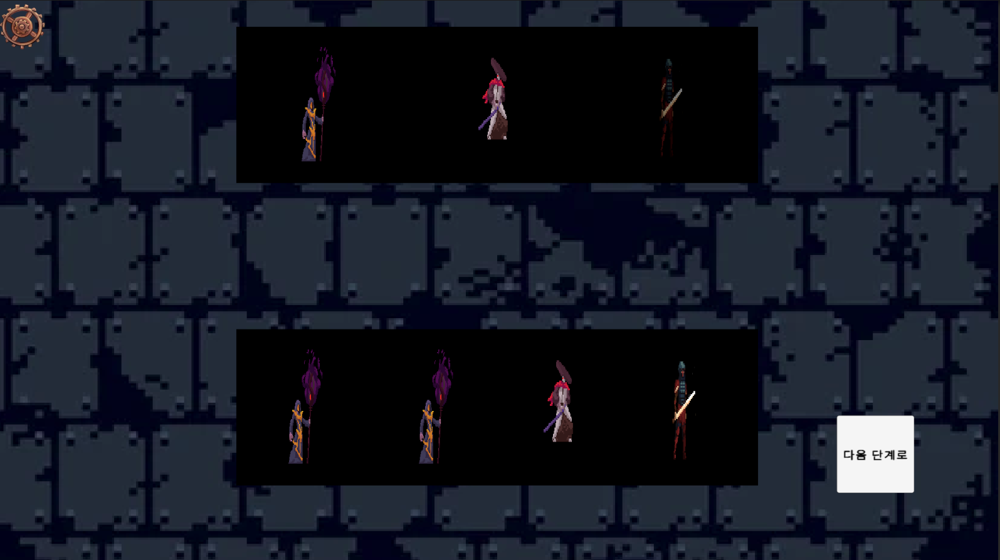

# Dungeon 🎲

## 🎮 프로젝트 소개
턴제 방식의 로그라이크 던전 클리어 게임입니다.  
- 캐릭터 3종 중 1종을 선택해 덱을 구성하고  
- 최소 10장의 카드를 사용해 던전을 클리어합니다.  
- 각 캐릭터는 서로 다른 플레이트를 보유하며, 카드를 통해 플레이트 속 키워드 수치를 조정합니다.  
- 매 턴마다 손패의 모든 카드를 사용해야 다음 턴으로 넘어갑니다.

## 🛠 사용 기술
- Unity (C#)
- 커스텀 카드 및 턴 진행 로직
- 유저 인터페이스 구현

## 📌 주요 기능
- **캐릭터 및 덱 구성**: 3종 캐릭터, 10장 이상 카드 조합 가능
- **턴제 진행**: 손패 전부 사용 시 턴 종료
- **플레이트 키워드 시스템**: 카드 효과에 따라 속성값 변화
- **던전 클리어 시스템**: 조건 충족 시 던전 클리어 처리

## 🧠 기술적 과제 & 해결 과정
- 카드와 키워드 수치 간 상호작용 구조 설계
- 플레이어가 모든 카드를 사용했는지 검사하는 체크 로직 구현
- 각 캐릭터의 특성과 덱 차별화를 위한 키워드 설계 고민

## 🖼️ 실행 화면 예시
### 캐릭터 선택 화면

### 카드 선택 화면

### 전투 초기 화면

### 전투 카드 전부 사용

### 다음 스테이지 초기 화면

## 📂 실행 방법
1. Unity **2019.4 이상** 버전에서 프로젝트 열기  
2. `MainScene` 실행  
3. UI를 통해 카드 선택 및 사용

## 🙋‍♂️ 담당 역할
- 프로젝트 전체 설계 및 구현  
- 카드 시스템, 캐릭터 특성, 턴 로직 개발

## 📚 프로젝트 성과 및 의의
- 덱 전략과 턴제 플레이의 재미를 구현하며 기본 구조 설계 경험  
- 간단한 게임이지만 확장 가능한 구조로 개발하려 노력함  
- Unity 기반 턴제 게임 로직과 UI 연동 실습

---
